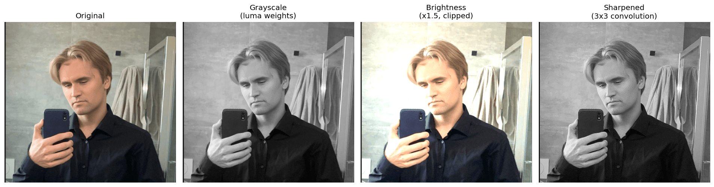

# Image Processing From Scratch

<p align="center">
  
  
  
  
</p>

A small notebook that implements classic image-processing operations — grayscale conversion, brightness adjustment, and 2D convolution — using nothing but `numpy` arrays. No `cv2`, no `scipy.ndimage`, no built-in filters. Every pixel transformation is written out by hand, on a real photo, to see exactly what these "basic" operations actually do under the hood.

<p align="center">
  
</p>

## Contents

- [Overview](#overview)
- [How it works](#how-it-works)
  - [Grayscale conversion](#1-grayscale-conversion)
  - [Brightness adjustment](#2-brightness-adjustment)
  - [2D convolution (sharpening)](#3-2d-convolution-sharpening)
- [Results](#results)
- [What I learned](#what-i-learned)
- [Running it yourself](#running-it-yourself)
- [Project structure](#project-structure)
- [License](#license)

## Overview

An image is just a 3D array of numbers — `(height, width, channels)`, values `0–255`. Once that clicks, most "image processing" stops looking like magic and starts looking like array arithmetic. This project works through three operations at that level:

1. **Load** a photo as a NumPy array and inspect its shape and dtype.
2. **Grayscale** — collapse the three color channels into one using perceptual luma weights.
3. **Brightness** — scale every pixel value and clip it back into a valid range.
4. **Convolution** — implement a 3×3 sliding-window filter from scratch (no library calls) and use it to sharpen the image.

It's a learning exercise, not a library — the goal is to build an intuition for what `cv2.cvtColor`, `ImageEnhance.Brightness`, and `cv2.filter2D` are doing internally, by doing it manually first.

## How it works

### 1. Grayscale conversion

```python
img = Image.open("nikita_kirkified.jpg")
arr = np.asarray(img)        # shape (944, 1002, 3), dtype uint8

R = arr[:, :, 0]
G = arr[:, :, 1]
B = arr[:, :, 2]

# luma weights — the human eye is most sensitive to green, least to blue
gray = R * 0.299 + G * 0.587 + B * 0.114
gray = gray.astype(np.uint8)
```

A naive grayscale would average the three channels equally (`(R+G+B)/3`), but the eye doesn't perceive red, green, and blue equally — green looks brightest, blue looks darkest for the same intensity. The `0.299 / 0.587 / 0.114` weights (from the ITU-R BT.601 standard) correct for this, so the resulting grayscale image matches how bright the colors actually *look*, not just their raw numeric average.

### 2. Brightness adjustment

```python
bright = arr * 1.5
bright = np.clip(bright, 0, 255).astype(np.uint8)
```

Brightening is just multiplication: every channel of every pixel gets scaled by a constant (`> 1` to brighten, `< 1` to darken). The catch is that `uint8` only holds `0–255` — multiplying by `1.5` can easily push a pixel to `380`, which would silently wrap around to `124` if cast directly. `np.clip` is what prevents that: anything over 255 gets capped at 255 *before* the cast back to `uint8`, so bright areas blow out to solid white instead of corrupting into random colors.

### 3. 2D convolution (sharpening)

```python
def convolve2d(image, kernel):
    kh, kw = kernel.shape
    pad = kh // 2

    # 'edge' padding repeats the border pixels, so the kernel has
    # something to read when centered on the image's edges
    padded = np.pad(image, pad, mode='edge')
    output = np.zeros_like(image, dtype=np.float64)

    for i in range(image.shape[0]):
        for j in range(image.shape[1]):
            patch = padded[i:i+kh, j:j+kw]
            output[i, j] = np.sum(patch * kernel)

    return np.clip(output, 0, 255).astype(np.uint8)

sharpen_kernel = np.array([
    [ 0, -1,  0],
    [-1,  5, -1],
    [ 0, -1,  0]
], dtype=np.float64)

sharpened = convolve2d(gray, sharpen_kernel)
```

This is the operation underneath almost every image filter — blur, sharpen, edge detection — they're all just a different 3×3 (or larger) matrix of numbers. `convolve2d` slides that matrix over every pixel, multiplies it element-wise with the 3×3 neighborhood of pixels under it, and sums the result into a single output pixel. The **sharpen kernel** above gives the center pixel a weight of `5` while subtracting its four direct neighbors — amplifying the *difference* between a pixel and its surroundings, which is exactly what makes edges look crisper.

Two details that aren't optional:
- **Padding** — without it, the kernel would fall off the edge of the array for border pixels. `mode='edge'` extends the border outward so every pixel, including corners, gets a full 3×3 neighborhood.
- **`float64` accumulation** — the sum `patch * kernel` can go negative or well above 255 mid-computation. Accumulating in `uint8` would wrap around and corrupt the result; the cast back to `uint8` (with `clip`) only happens at the very end.

## Results

| Step | Operation | Effect on `nikita_kirkified.jpg` |
|------|-----------|-----------------------------------|
| Original | — | `(944, 1002, 3)`, `uint8` RGB |
| Grayscale | `R*0.299 + G*0.587 + B*0.114` | Single-channel luma image, perceptually weighted |
| Brightness | `arr * 1.5`, clipped | Lighter overall, highlights pushed to pure white |
| Sharpened | 3×3 convolution, kernel sum = 1 | Edges and texture (hair, jacket folds) visibly enhanced |

<p align="center">
  
</p>

Because the sharpen kernel's weights sum to `1` (`5 - 1 - 1 - 1 - 1 = 1`), flat regions of the image (constant color) pass through unchanged — only areas where neighboring pixels *differ* get pushed apart, which is why the sharpening effect is concentrated around edges rather than washing out the whole image.

## What I learned

- **An image is an array, full stop.** Every operation here — grayscale, brightness, sharpening — is just NumPy arithmetic (`*`, `+`, slicing, `np.clip`) on a `(H, W, 3)` array of `uint8`s. There's no hidden "image" abstraction underneath libraries like OpenCV; this *is* the abstraction.
- **`uint8` overflow is silent and dangerous.** `arr * 1.5` produces values that don't fit in 8 bits. Without `np.clip` *before* casting back to `uint8`, a pixel at `300` wraps to `44` — turning bright highlights into random dark speckles. Clip-then-cast is the pattern, always in that order.
- **Convolution is one idea applied everywhere.** Blur, sharpen, edge detection, and (at a much larger scale) every layer of a CNN are the same sliding-window-multiply-and-sum operation with a different matrix of numbers. Writing `convolve2d` once demystifies all of them.
- **Padding is a design decision, not a technicality.** `mode='edge'` was chosen specifically so border pixels get a sensible neighborhood instead of zeros (which would darken every edge of the image). The choice of padding mode visibly changes the output at the image's border.
- **Precision matters during computation, not just storage.** Accumulating convolution sums in `float64` and only converting to `uint8` at the final step is what keeps negative and out-of-range intermediate values from corrupting the result.

## Running it yourself

The whole project lives in a single notebook, [`main.ipynb`](main.ipynb).

```bash
git clone https://github.com/nikitakuzmin06/image-processing-from-scratch.git
cd image-processing-from-scratch
pip install numpy pillow matplotlib jupyter
jupyter notebook main.ipynb
```

Run the cells top to bottom: each one loads the bundled sample image (`nikita_kirkified.jpg`), applies one operation, and plots the result with `matplotlib`.

> **Note:** to try this on your own image, just swap out `nikita_kirkified.jpg` for any other photo — the rest of the pipeline works unchanged. To regenerate the preview images in `assets/`, run `python generate_assets.py`.

## Project structure

```
.
├── main.ipynb            # grayscale, brightness, and convolution — the whole pipeline
├── generate_assets.py    # regenerates the README preview images
├── nikita_kirkified.jpg  # sample input image
├── assets/               # images used in this README
│   ├── original.jpg
│   ├── grayscale.png
│   ├── brightness.png
│   ├── sharpened.png
│   └── pipeline-comparison.png
├── LICENSE
└── README.md
```

## License

Released under the [MIT License](LICENSE).
